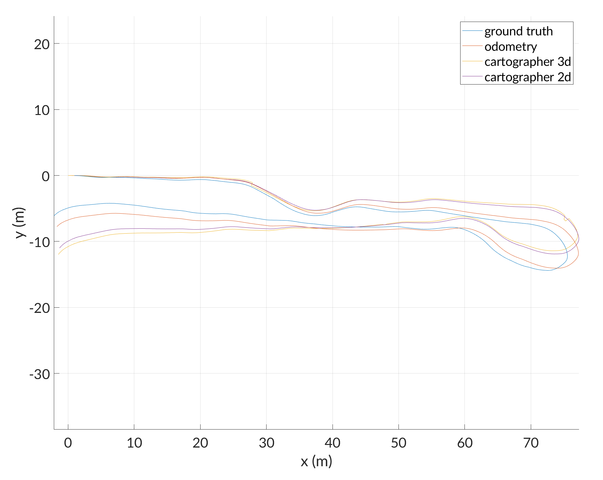
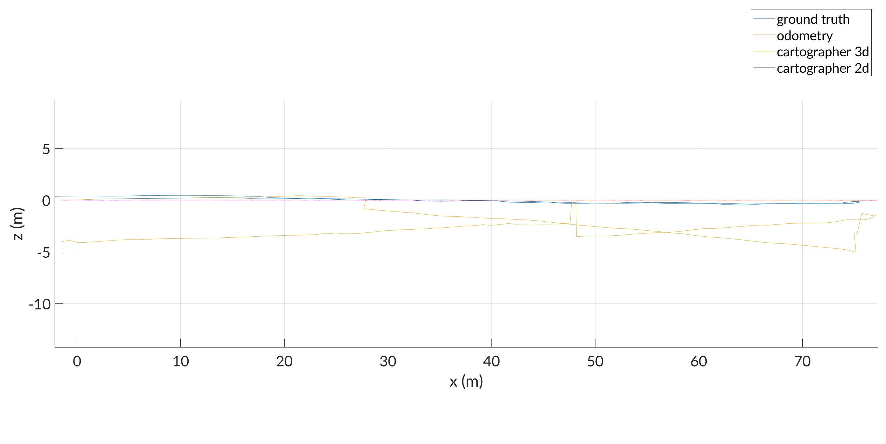

# csv-slam

csv-slam is a C++17 command-line interface to [Google Cartographer](https://opensource.google/projects/cartographer) for use with the [North Campus Long Term (NCLT)](http://robots.engin.umich.edu/nclt/) dataset. [CMake](https://cmake.org/) 3.11 and a C++17 compiler are required, as are the Google Cartographer, [Boost](https://www.boost.org/) 1.58 or newer, including Boost.Iostreams, and [Eigen](http://eigen.tuxfamily.org/index.php?title=Main_Page) libraries.

## Example Output





## Usage

Input is provided to csv-slam in the form of CSV and binary files as downloaded from the NCLT dataset wensite. Output is emitted as a CSV file in the same format as the odometry and ground truth files from the NCLT dataset, but using radians for angular position. csv-slam is intended to be used through the [`csv_slam.py`](csv_slam.py) entrypoint. For usage information, pass the `-h,--help` option to `csv_slam.py`. See example output below:

```
$ python csv_slam.py --help
usage: csv_slam.py [-h] {clean,build,run} ...

run Cartographer on NCLT Velodyne hits, IMU data, and (optionally) odometry
data

positional arguments:
  {clean,build,run}
    clean            remove artifacts built by this script
    build            compile csv-slam without running it
    run              compile (if necessary) and run csv-slam

optional arguments:
  -h, --help         show this help message and exit
```

```
$ python csv_slam.py clean --help
usage: csv_slam.py clean [-h]

optional arguments:
  -h, --help  show this help message and exit
```

```
$ python csv_slam.py build --help
usage: csv_slam.py build [-h] [-d | -r | -b BUILD_TYPE]
                         [-m | -n | -g GENERATOR] [-c CMAKE_PATH]
                         [-a CMAKE_ARGS] [-v]

optional arguments:
  -h, --help            show this help message and exit
  -d, --debug           pass -DCMAKE_BUILD_TYPE=Debug to cmake (default:
                        Debug)
  -r, --release         pass -DCMAKE_BUILD_TYPE=Release to cmake (default:
                        Debug)
  -b BUILD_TYPE, --build-type BUILD_TYPE
                        passed to cmake as "-DCMAKE_BUILD_TYPE=$BUILD_TYPE"
                        (default: Debug)
  -m, --unix-makefiles  pass '-G Unix Makefiles' to cmake (default: None)
  -n, --ninja           pass '-G Ninja' to cmake (default: None)
  -g GENERATOR, --generator GENERATOR
                        passed to cmake as "-G $GENERATOR" (default: None)
  -c CMAKE_PATH, --cmake-path CMAKE_PATH
                        path to or name of the cmake executable to run
                        (default: cmake)
  -a CMAKE_ARGS, --cmake-args CMAKE_ARGS
                        additional arguments passed directly to cmake. split
                        by shlex.split (default: [])
  -v, --verbose         print executed commands and pass stdout and stderr
                        through (default: False)
```

```
$ python csv_slam.py run --help
usage: csv_slam.py run [-h] [-d | -r | -b BUILD_TYPE] [-m | -n | -g GENERATOR]
                       [-c CMAKE_PATH] [-a CMAKE_ARGS] [-v] [-p PREFIX]
                       CONFIG VEL IMU [ODOMETRY] OUTPUT

positional arguments:
  CONFIG                Lua configuration file for Cartographer
  VEL                   binary file containing Velodyne hits
  IMU                   CSV file containing MS25 IMU data
  ODOMETRY              CSV file containing odometry data (default: None)
  OUTPUT                file to write CSV-formatted output trajectory

optional arguments:
  -h, --help            show this help message and exit
  -d, --debug           pass -DCMAKE_BUILD_TYPE=Debug to cmake (default:
                        Debug)
  -r, --release         pass -DCMAKE_BUILD_TYPE=Release to cmake (default:
                        Debug)
  -b BUILD_TYPE, --build-type BUILD_TYPE
                        passed to cmake as "-DCMAKE_BUILD_TYPE=$BUILD_TYPE"
                        (default: Debug)
  -m, --unix-makefiles  pass '-G Unix Makefiles' to cmake (default: None)
  -n, --ninja           pass '-G Ninja' to cmake (default: None)
  -g GENERATOR, --generator GENERATOR
                        passed to cmake as "-G $GENERATOR" (default: None)
  -c CMAKE_PATH, --cmake-path CMAKE_PATH
                        path to or name of the cmake executable to run
                        (default: cmake)
  -a CMAKE_ARGS, --cmake-args CMAKE_ARGS
                        additional arguments passed directly to cmake. split
                        by shlex.split (default: [])
  -v, --verbose         print executed commands and pass stdout and stderr
                        through (default: False)
  -p PREFIX, --prefix PREFIX
                        prefix before the executable. split by shlex.split
                        (default: [])
```

csv-slam may also be built as a regular CMake project. The output executable, `csv-slam`, has the same positional arguments as `python csv_slam.py run`, but does not support optional named arguments like `-p,--prefix`.

```
$ git clone https://github.com/Gregory-Meyer/csv-slam.git
$ cd csv-slam
$ mkdir build
$ cd build
$ cmake ..
$ cmake --build . -j $(nproc)
$ ./csv-slam $CONFIG $VEL $IMU [$ODOMETRY] $OUTPUT
```

## Configuration

csv-slam is configured with Cartographer Lua configuration files. Only the current working directory is searched when including other files from within a Lua configuration file.

## Authors

csv-slam is authored by Chao Chen, Kevin Han, Gregory Meyer, and Sumukha Udupa.

## License

csv-slam is licensed under the [GNU Affero General Public License v3.0 or later](https://spdx.org/licenses/AGPL-3.0-or-later.html) license.
